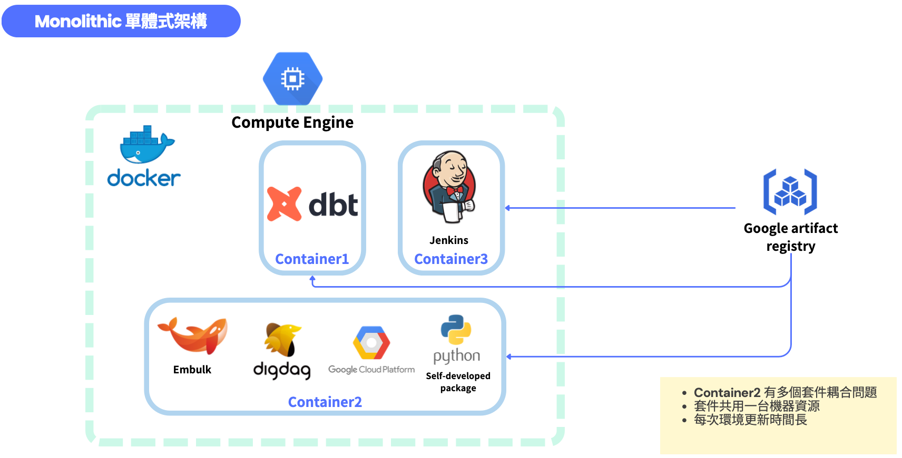
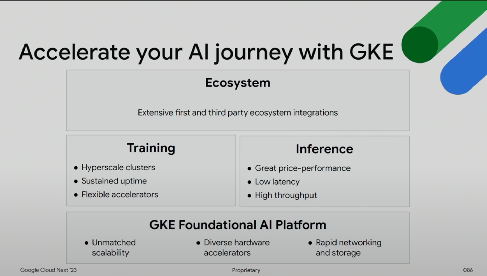
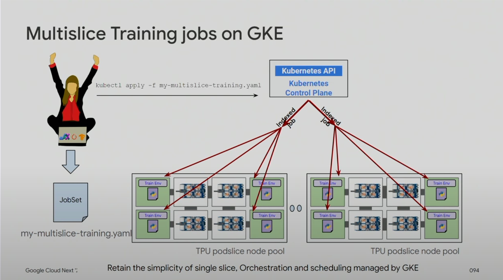

Google Kubernetes Engine (GKE)
===

## Google Kubernetes Engine 

### Why GKE?

- New Tools ,Framework <- 需要動態滿足及擴增情境提供客戶。 良好的擴展性
- AI Foundation platform. 客製化的CPU , Memory , TPU
- 大型語言模型 網路至關重要 -> Node可能會擴展
- 模型成長遠遠大於硬體成長

A Platform For All Workloads
3

### AI journey on GKE



### Trainging jobs on TPU VMS today


### Trainging jobs on in GKE VMS


### Muliclice Training jobs on GKE



### Keyword 

Node Pool：很多機器 ＝ instance group

Node： 相當於 VM 一個node及對應一台GCE (使用standard cluster時可以在GCE上看到許多Node)

Cluster：整個叢集(包含node,pod,....)

Master：是這個Cluster的控制中心，裡面安裝了kubernetes controller，可以控制cluster中所有components的行為


### Cloud Shell ###
Cloud Shell預設有Google Cloud CLI,kubectl工具

設置默認項目ID(projectID):
```
gcloud config set project PROJECT_ID
```
