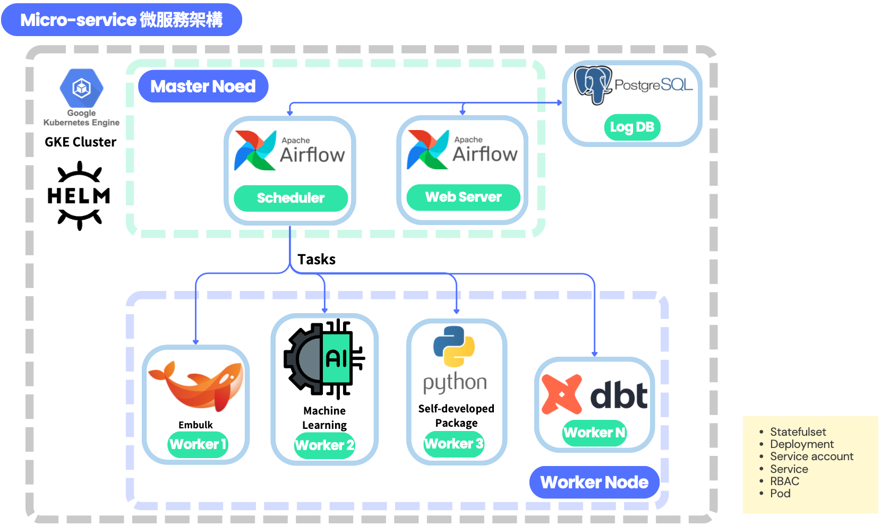

Google Kubernetes Engine (GKE)
===

## Google Kubernetes Engine 

Node Pool：很多機器 ＝ instance group

Node： 相當於 VM 一個node及對應一台GCE (使用standard cluster時可以在GCE上看到許多Node)

Cluster：整個叢集(包含node,pod,....)

Master：是這個Cluster的控制中心，裡面安裝了kubernetes controller，可以控制cluster中所有components的行為


### Cloud Shell ###
Cloud Shell預設有Google Cloud CLI,kubectl工具

設置默認項目ID(projectID):
```
gcloud config set project PROJECT_ID
```
建立GKE Cluster(集群)
---
### **Autopilot VS Standard Cluster**

1.Standard 是根據所開的 Node 及 master node 管理費做收費，Autopilot則是根據 Pod 所起的 CPU/Memory/Storage..去做收費

2.Standard 須管理Nodes(及相關 Scalling..,node,IP...等)

3.Autopilot 有非常多管理上的受限，所以有些特殊的Config設定，不一定能自由修改。

註1:Autopilot default以Google經歷的Best Practice，可以使開發者更專注於開發

註2:Standard則是多數仍須自行管理，但有了更多的彈性

註3:目前兩種模式不存在切換!

### Public Cluster（公共集群）：

1.GKE 的 Master 部分是公開可訪問的，它具有Public IP 地址，可以從 Internet 上的任何位置訪問。

2.Worker Nodes（節點）位於 Google Cloud Platform（GCP）的公共 IP 網路中，它們可以直接連接到公共 IP 網路上的其他 GCP 服務和外部服務。

3.在 Public Cluster 中，Pod 和 Service 可以直接訪問外部的公共 IP 和 DNS 網址，並且也可以被外部訪問。

### Private Cluster（私有集群）：
1.GKE 的 Master 部分是私有的，它沒有公共 IP 地址，不允許從 Internet 直接訪問。只有集群所在的 VPC 內的機器和服務可以訪問 Master。

2.Worker Nodes 位於 Google Cloud Platform（GCP）的私有 IP 網路中，它們不能直接連接到公共 IP 網路上的外部服務，除非通過 VPC Peering、VPN 等方式進行連接。

3.在 Private Cluster 中，Pod 和 Service 預設只能訪問 VPC 內部的資源，除非進行相應的網路配置，否則不能直接訪問外部的公共 IP 和 DNS 網址。您需要透過 Private Google Access、VPC Peering 等方式來實現連接外部資源的需求。

總結來說，Public Cluster 提供了更直接的公共 Internet 訪問能力，而 Private Cluster 則更適合需要更高安全性的場景，它將 GKE Master 隔離在私有網路中，並且僅允許授權的節點和服務訪問。選擇使用 Public Cluster 還是 Private Cluster 取決於您的應用需求和安全要求。

-----------------------------------------
一個集群(cluster)包含至少一個cluster control機器和多台worker機器

節點(Nodes)是實際運行應用程式的地方。透過將應用程式部署到叢集，您可以管理和調度應用程式的執行，使其在節點上運行並提供所需的服務。

**建立一個cluster(standard)**
```
gcloud container clusters create ${cluster_name} --region=${REGION}
```
**建立一個cluster(Autopilot)**
```
gcloud container clusters create-auto ${cluster_name} --region=${REGION}
```

    
可用參數說明: 
- --enable-ip-alias 使Cluster成為VPC原生cluster(目前Autopilot模式已預設啟用)
- --enable-private-nodes 使該cluster沒有External IP
- --master-ipv4-cidr 用於指定Control Plane Internal IP範圍
- --region asia-east1 該cluster區域
- --project=datapool-1806 該cluster所屬project
- --network vpn 選擇該cluster的VPC network
- --subnetwork vpn-asia-east1 選擇該cluster的VPC network的subnetwork
- --enable-master-authorized-networks 用來指定授權的 IP CIDR 訪問。
- --enable-private-endpoint 表示使用控制层面 API 端点的专用 I- 地址管理集群。

**檢視cluster list**
```
gcloud container clusters list
```
**獲取身份驗證** (須確認有無gke-gcloud-auth-plugin)
```
gcloud container clusters get-credentials hello-cluster --region ${REGION}
```
**透過檔案，創建Pod/Deployment/Service..**
因為我們需要在cluster中執行embulk
```
kubectl apply -f file_name
```
刪除
---
**刪除cluster**
```
gcloud container clusters delete hello-cluster --region ${REGION}
```
###### tags: `Templates` `Documentation`



**建立cluster後**
建立reate一個cluster後 GKE會幫你做這些事情：

1.根據你選定的VPC及設定的 VM type，開啟node
2.建立一個 Master 在Google管理的VPC裡面，為了讓master管理node，因此有了VPC peering
3.根據你在頁面上設定的 service address range pod address range ，之後kubernetes再開components時，會開在對應的網段裡面(也可以用default設定，這樣google會幫你切網段)

Demo
---
建立image，並上傳至GCR
接下來可以在本機，或是在console上建立cluster
```
gcloud container clusters create-auto ${cluster_name} --region=${region}
```
接下來我們希望在該cluster中建立Job，有兩種方式:
1.在console中，使用cloudshell
2.在本地連接指定cluster，並建立Job:
```
kubectl apply -f job.yaml
```
