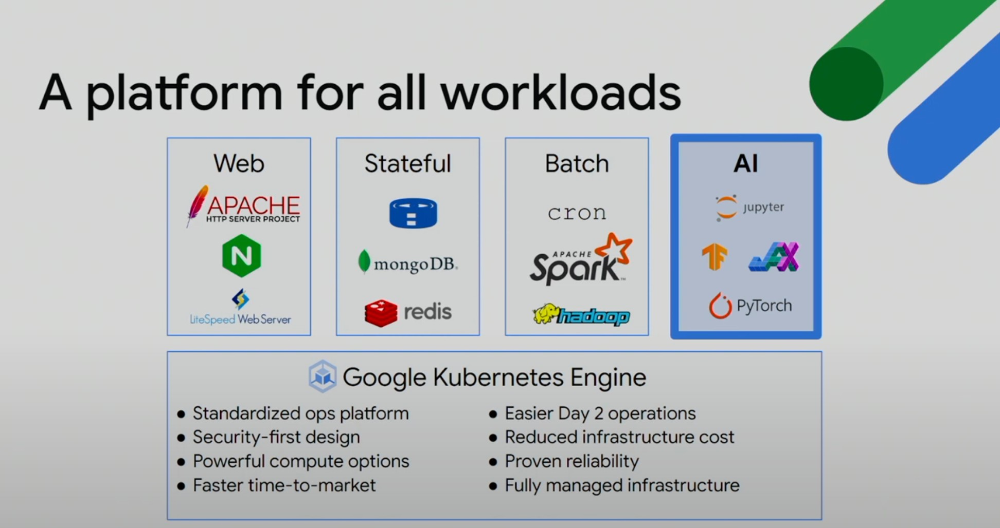
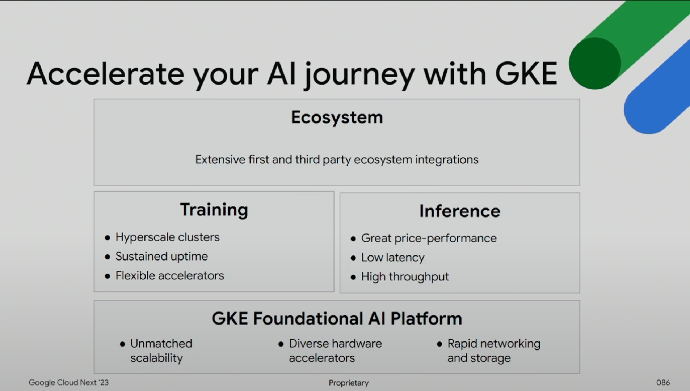
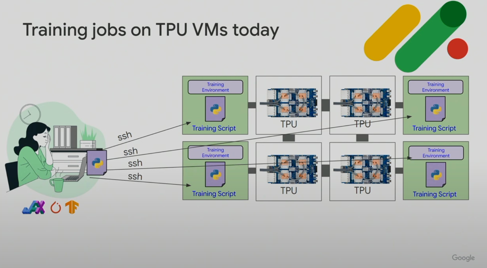
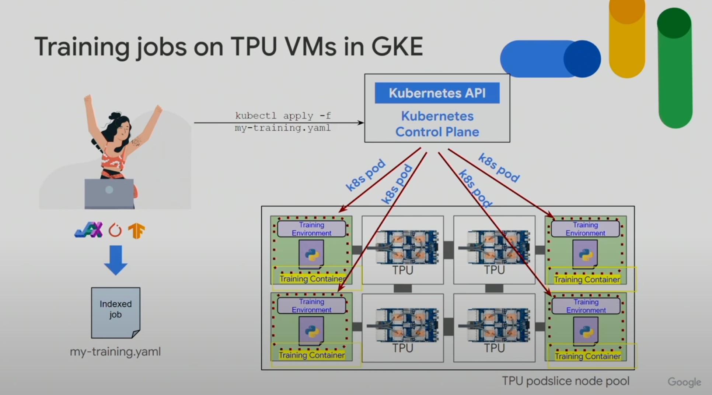
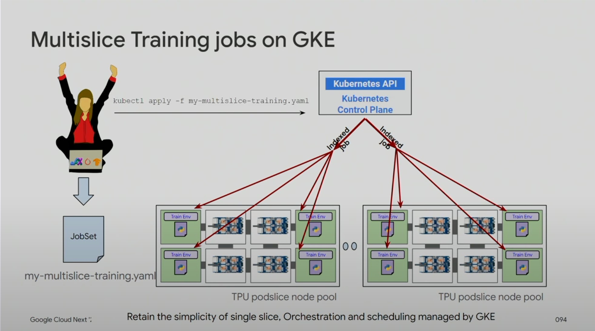
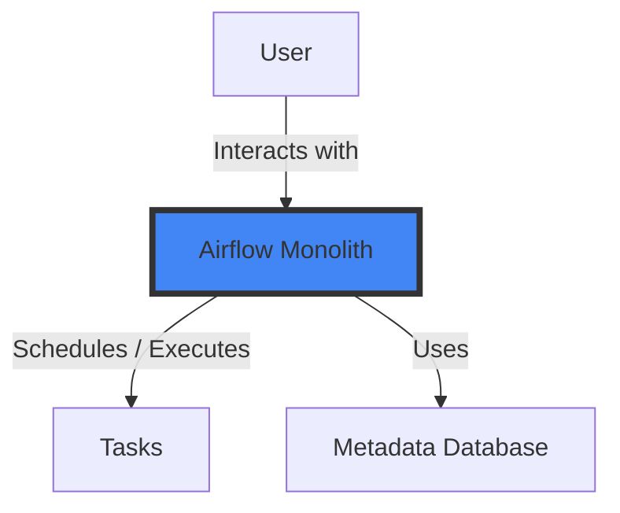
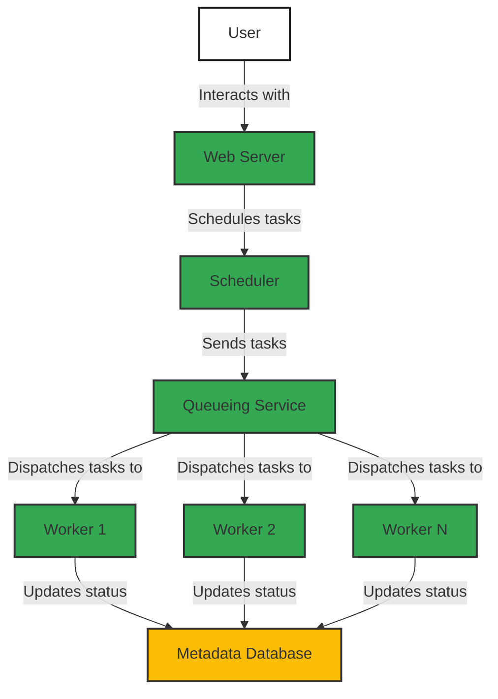

Google Kubernetes Engine (GKE)
===
---
## Agenda
 - Background
 - Architecture
 - Setting

Background
===
#### Why GKE ?
- New Tools ,Framework <- 需要動態滿足及擴增情境提供客戶。 良好的擴展性
- AI Foundation platform. 客製化的CPU , Memory , TPU
- 大型語言模型 網路至關重要 -> Node可能會擴展
- 模型成長遠遠大於硬體成長

A Platform For All Workloads


#### AI journey on GKE



#### Trainging jobs on TPU VMS today



#### Trainging jobs on in GKE VMS



#### Muliclice Training jobs on GKE


---

Architecture
===
### 原先的單體式架構(Monolithic)

**優點**
- 學習成本較低
- 僅需維運一台Node
- 需要增加硬體資源(垂直擴張)，以期待可以處理更多工作。

**缺點**: 

- 環境相依性高
- 風險大 : 當一個Service掛掉，影響多個服務，甚至整台機器
- 環境及套件部署緩慢 ← 不利於AI,ML發展，因整個每次更新就是整台機器重新啟動。


### 希望調整成的微服務架構 (Micro-Service) GKE

註 : 每一個worker皆為一個獨立的節點(Node)

**優點**

- 確保整體系統的穩定性和效能。
- 提高軟體和商務對接的速度，提升開發速度及產能
- 依據需求，各自交付,部署，彼此互不干涉，易維運
- 最大化地利用硬體資源(Auto-Scale功能)，提高伺服器的效率。
- 降低風險，”服務(Pod)”故障時，僅損壞單一服務
- 可利用 Kubermetes 優勢 ; **Scalability** , **Load Balancing ...**

**缺點**: 

- Expensive Calls: 原本放在一起的元件都被拆成獨立的Service，會讓傳遞及溝通的成本變大
- 學習成本較大
- 需管理多個 微服務

---

Setting
===

### Keyword 

- Node Pool：很多機器 ＝ instance group

- Node： 相當於 VM 一個node及對應一台GCE (使用standard cluster時可以在GCE上看到許多Node)

- Cluster：整個叢集(包含node,pod,....)

- Master：是這個Cluster的控制中心，裡面安裝了kubernetes controller，可以控制cluster中所有components的行為

1. 首先我們需要建立 Cluster , 以及相關的Network以及Service account作設定。
2. 接下來便是將各項應用服務之環境透過Docker部署
3. 若是使用Helm 則可直接使用Helm install 並修改 values.yaml

### Cloud Shell
Cloud Shell預設有Google Cloud CLI,kubectl工具

設置默認項目ID(projectID):
```
gcloud config set project PROJECT_ID
```

### Cluster Setting
在理解基礎架構後 , 需要先建立Cluster
- [Cluster](element/Cluster/cluster.md)

### Workload Identity
需要先將Kubernetes Service account做相關設定
- [Workload Identity](Workload_Identity/workload-Identity.md)

### Network
希望將Pod透過VPC對外連線 , 需要設定以下:
- [ip-masq-agent](Network/ip-masq-agent/ip-masq-agent.md)
- [EgressNATpolicy](Network/EgressNATpolicy/EgressNATpolicy.md)

### Resource && Priority Setting
可以直接透過Pod.yaml設定resource requetsts
- [Pod](element/Pod/readme.md)
   - [Priority class](https://kubernetes.io/docs/concepts/scheduling-eviction/pod-priority-preemption/)
   - [Resources request]
- 也可以透過 Deployment 設定

### GCS mount

- [Cloud Storage FUSE CSI driver](gcs_fuse_csi_driver/README.md)

### kubectl

當希望在cluster中使用kubectl時 , 需仔細比較下列差異:
- [kubectl aplly & kubectl exec](Kubectl/README.md)
   
### With Helm 
如果部署的服務,提供 Helm chart會是更簡易的方式
將上述所提到的 cluster 建立並且設定好 Network後 即可直接透過 Helm 部署

- [Helm](helm/README.md)